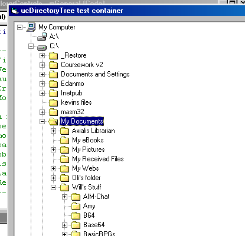



## Shell integrated DirectoryTree control

### Description

This is not just a standard DirectoryTree control. It is enhanced over the various submissions here in several ways - firstly, it doesn't use the Dir$() command, or the FSO for two reasons: 1) speed, and 2) filesize (The FSO adds a huge dependancy). Instead, it uses API wherever possible. Secondly, it doesn't use dummy nodes to simulate children, but instead it popuplates each node fully, then uses the scarcely documented ApiSHChangeNotifyRegister API to register for shell change events (When a folder created, renamed, moved, or removed). This produces a control that is well integrated with Explorer.

Lastly, it has a right click menu to allow controls over the directories - renaming, creation and deletion. Any action you perform on the control will be performed on the local disk! If you rename your desktop, it will really be renamed! (So don't do it.. :D)

It's been tested on several Windows systems, but if you find any bugs, I'd love to know about them.

If you like it, vote. Thanks :)
 
### More Info
 

             |
---                |---
**Submitted On**   |2003-01-10 11:23:02
**By**             |[Will Barden](https://github.com/Planet-Source-Code/PSCIndex/blob/master/ByAuthor/will-barden.md)
**Level**          |Intermediate
**User Rating**    |4.8 (43 globes from 9 users)
**Compatibility**  |VB 6\.0
**Category**       |[Custom Controls/ Forms/  Menus](https://github.com/Planet-Source-Code/PSCIndex/blob/master/ByCategory/custom-controls-forms-menus__1-4.md)
**World**          |[Visual Basic](https://github.com/Planet-Source-Code/PSCIndex/blob/master/ByWorld/visual-basic.md)
**Archive File**   |[Shell\_inte153874232003\.zip](https://github.com/Planet-Source-Code/will-barden-shell-integrated-directorytree-control__1-42920/archive/master.zip)

